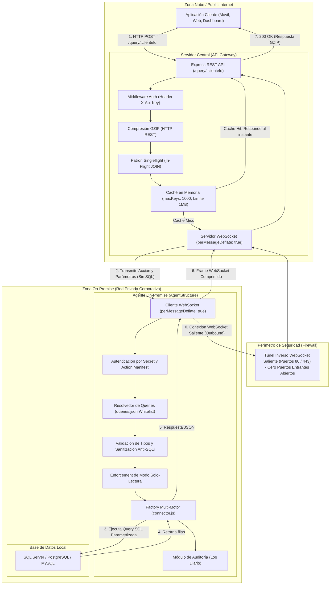
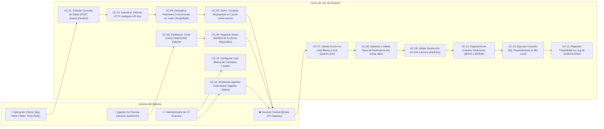
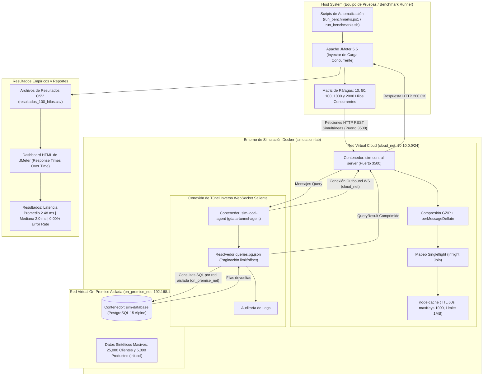

# 🛡️ AgentStructure

[](https://nodejs.org)
[](https://www.docker.com/)
[](DOCUMENTACION_TESIS_AGENTSTRUCTURE.md)

**Soberanía de Datos, Conectividad Segura y Alto Rendimiento para Entornos On-Premise.**

**AgentStructure** es una arquitectura híbrida de **Agente-Servidor** con **túnel inverso por WebSockets** diseñada para resolver un problema crítico de integración: permitir que aplicaciones externas o en la nube consuman datos específicos de bases de datos locales (On-Premise) de forma segura, **sin abrir puertos entrantes en el firewall, sin exponer credenciales y manteniendo total control local sobre las sentencias SQL.**

Este proyecto ha sido desarrollado como propuesta de **Tesis de Grado** para la integración segura de datos corporativos en redes locales cerradas.

---

## 💡 El Problema y la Solución

### El Desafío Común
Las organizaciones suelen ser reticentes (y por normativa de ciberseguridad, no deben) exponer sus credenciales de base de datos o abrir puertos de entrada en sus firewalls (`3306`, `5432`, `1433`) para conectar aplicaciones externas.

### La Propuesta de AgentStructure
En lugar de que el servidor en la nube guarde las queries SQL y posea acceso directo a la base de datos:

1. **Las queries residen localmente en el Agente**, dentro de la red corporativa privada (`queries.json`).
2. El Servidor Central actúa como un **Broker Broker-Mediator transparente**: solo conoce **nombres de acciones** (por ejemplo: `get_clientes_paginados`) y sus parámetros.
3. El Agente inicia la conexión al Servidor mediante un túnel seguro bidireccional de salida (**WebSockets Outbound**), evitando abrir puertos de entrada.
4. Cuando el Servidor recibe una petición HTTP, retransmite la acción al Agente, quien resuelve la consulta localmente, valida tipos de datos, aplica el modo solo-lectura, audita el acceso y retorna únicamente los resultados sanitizados.

---

## 🎨 Diagramas del Sistema

### 1. Diagrama de Conexión y Arquitectura General
El siguiente diagrama detalla la topología de red, el perímetro de seguridad y el flujo bidireccional de peticiones desde la aplicación cliente hasta la base de datos local:



---

### 2. Diagrama de Casos de Uso
Especificación formal de los casos de uso y las interacciones entre los diferentes actores del sistema:



---

### 3. Diagrama Completo del Laboratorio de Simulación y Benchmarking
Arquitectura del laboratorio experimental en Docker (`simulation-lab`) y la suite automatizada de pruebas de carga con Apache JMeter:



---

## ✨ Características Destacadas

- 🔒 **Soberanía Absoluta del Dato:** Las sentencias SQL residen en el cliente/empresa. La lógica de base de datos nunca sale de la red local.
- 🔌 **Conexión Inversa (WebSockets):** El Agente se conecta al Servidor. Cero configuraciones de Firewall o NAT en la infraestructura corporativa.
- 🚀 **Patrón Singleflight (Anti Thundering Herd):** Deduplica peticiones concurrentes idénticas en vuelo para compartir una sola consulta activa, reduciendo la carga en la base de datos.
- 📦 **Compresión de Doble Capa:**
  - **GZIP (`compression`)** para respuestas HTTP REST (~70% reducción de tamaño).
  - **`perMessageDeflate`** para la compresión binaria nativa de tramas WebSocket.
- 📑 **Paginación Nativa Parametrizada (`get_clientes_paginados`):** Soporte de `@limit` y `@offset` como enteros para transferir volúmenes masivos de datos en lotes seguros.
- 🛡️ **Seguridad Multi-Nivel:**
  - **API Key** (`X-Api-Key`) para aplicaciones externas.
  - **Secretos criptográficos individuales** por cada Agente registrado en `agents.json`.
  - **Action Manifest:** El Agente registra sus acciones disponibles al conectarse para validación anticipada en el servidor.
  - **Modo Solo-Lectura (`readOnly`):** Bloqueo por contrato de sentencias `INSERT`, `UPDATE`, `DELETE`, `DROP`.
- 📊 **Auditoría e Historial:** Logs diarios persistentes en el agente local que detallan acción, parámetros, estado, tiempo de respuesta y filas devueltas.
- 🗄️ **Multi-Motor de Base de Datos:** Soporte nativo mediante patrón Factory (`connector.js`) para:
  - **PostgreSQL**
  - **MySQL / MariaDB**
  - **Microsoft SQL Server (MSSQL)**

---

## 📂 Estructura del Repositorio

- [`/agent`](file:///c:/Users/carlo/OneDrive/Escritorio/TRABAJO/agentstructuretest/agent): Código fuente del Agente local, resolvedor de queries, auditoría y drivers.
- [`/server`](file:///c:/Users/carlo/OneDrive/Escritorio/TRABAJO/agentstructuretest/server): Código del Servidor Central (API Gateway, WebSocket Hub, Singleflight, GZIP, Caché).
- [`/simulation-lab`](file:///c:/Users/carlo/OneDrive/Escritorio/TRABAJO/agentstructuretest/simulation-lab): Entorno experimental en Docker, base de datos sintética (25k clientes), plan de pruebas Apache JMeter y scripts de benchmarking.
- [`/landing`](file:///c:/Users/carlo/OneDrive/Escritorio/TRABAJO/agentstructuretest/landing): Landing page interactiva construida en **React 19 + Vite**.
- [`/windows-installer`](file:///c:/Users/carlo/OneDrive/Escritorio/TRABAJO/agentstructuretest/windows-installer): Aplicación de escritorio en **Electron + WinSW** para instalar componentes como servicios de Windows.
- [`DOCUMENTACION_TESIS_AGENTSTRUCTURE.md`](file:///c:/Users/carlo/OneDrive/Escritorio/TRABAJO/agentstructuretest/DOCUMENTACION_TESIS_AGENTSTRUCTURE.md): Documento técnico completo y académico para la Tesis de Grado.

---

## 🛠️ Instalación y Configuración

### Paso 1: Clonar el Repositorio e Instalar Dependencias

```bash
git clone https://github.com/PoetArtist1/agentstructuretest.git
cd agentstructuretest
node install.js
```

El script interactivo `install.js` te guiará para configurar los componentes.

---

### Paso 2: Configuración del Servidor Central (Cloud)

#### 1. Archivo `server/.env`
```env
PORT=3500
API_KEY=mi-clave-de-api-super-segura
QUERY_TIMEOUT_MS=30000
CACHE_DEFAULT_TTL=60
```

#### 2. Archivo `server/agents.json`
```json
{
  "empresa_ejemplo": {
    "secret": "generar-un-secret-unico-aqui",
    "description": "Cliente principal - Base de Datos Local"
  }
}
```

---

### Paso 3: Configuración del Agente On-Premise

#### 1. Archivo `agent/config.json`
```json
{
  "serverUrl": "ws://localhost:3500/ws",
  "clienteId": "empresa_ejemplo",
  "secret": "generar-un-secret-unico-aqui",
  "readOnly": true,
  "reconnect": {
    "initialDelayMs": 1000,
    "maxDelayMs": 30000,
    "backoffMultiplier": 2
  },
  "dbEngine": "mssql",
  "db": {
    "server": "localhost",
    "port": 1433,
    "database": "MiBaseDeDatos",
    "user": "sa",
    "password": "MiPasswordSeguro123"
  }
}
```

#### 2. Archivo `agent/queries.json` (Lista Blanca)
```json
{
  "get_clientes_paginados": {
    "description": "Obtiene clientes paginados de forma segura",
    "sql": "SELECT Codigo as IDCliente, Descripcion as razon_social FROM Clientes ORDER BY Codigo OFFSET @offset ROWS FETCH NEXT @limit ROWS ONLY",
    "params": {
      "limit": { "type": "int", "required": true },
      "offset": { "type": "int", "required": true }
    }
  }
}
```

---

## 🧪 Pruebas de Rendimiento (Simulation Lab & Docker)

Para ejecutar las pruebas automatizadas de rendimiento y benchmarking con **Apache JMeter** y **Docker Compose**:

```powershell
# 1. Levantar la infraestructura de prueba en Docker
cd simulation-lab
docker compose up --build -d

# 2. Ejecutar la suite de benchmarking (10, 50, 100, 1000 y 2000 hilos)
cd jmeter
.\run_benchmarks.ps1
```

Los reportes HTML interactivos y archivos CSV se generarán automáticamente en `simulation-lab/resultados-benchmark/`.
